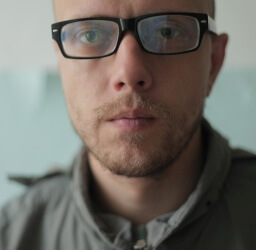

Aleksey Grishchenko

•
[CV PDF 2024](cv/bio-cv-2024.pdf) •
[CV PDF 2022 (Deutsch)](cv/bio-cv-2022_de.pdf) •

I am a New Media Artist and Technologist with a keen interest in game design and production.

I graduated from Novosibirsk State Technical University with a degree in Design and Technology of Radio Electronics.

From 1999 to 2004, I worked as a Junior Researcher at the Newest Media Department of the Institute of Archaeology and Ethnography. During this time, I was designing and programming GIS and 3D-scanning applications for archaeologists.

In 2005, I worked as an artist assistant at the first Moscow biennale of contemporary art, where I assisted with film production for Clemens von Wedemeyer.

In 2006, I was in the artist residence Blumen in Leipzig, where I worked as a feature film director and video editor. Later, I worked as an artist and video editor in Moscow, but in late 2009, I returned to Novosibirsk.

Back in Siberia, I experimented with video production, but later returned to hardware engineering and programming for art installations. I also gained expertise in 3D-printing and 3D-scanning/photogrammetry.

During this time, I started organizing exhibitions and open-culture activities, including:
Series of workshops “Art & Technology” (2011-2016)
A self-organized artists’ space and studios “Studio 109” (2012-2018)
Monthly exhibitions “Grishchenko’s Garage” (2016-2019)
Regular game-jam which later became “Siberian Game Jam” (2017)

From 2018 to 2020, I worked as an R&D Datascientist at Motiv-NT, a company providing industrial solutions based on Neural Networks, Computer Vision, and Data Science. My job was to develop a pipeline for generating synthetic data for consistent neural networks based production quality control.

Since 2021, I have been working as a freelance artist and technology consultant. My current interests revolve around working with 3D-data (photogrammetry, point clouds, 3DGS) and game development and production.

English C1+, German A2, Russian(native).

Phone: +49 178 4516663
E-mail: aleksey.grishchenko [bakr] gmail.com
Website: [eggnot.com](https://eggnot.com/)

## Skills and links:

Visual art : 
[www.instagram.com/eggnot1](https://www.instagram.com/eggnot1)

Game design and programming :
[eggnot.itch.io](https://eggnot.itch.io/)

3d-scanning and modeling :
[sketchfab.com/eggnot/models](https://sketchfab.com/eggnot/models)

3d printing & design :
[thingiverse.com/eggnot/designs](https://www.thingiverse.com/eggnot/designs)

Film direction and video editing :
[vimeo.com/43517630](https://vimeo.com/43517630)

Computer Vision Datascience :
[youtube.com/watch?v=osx9ryyAAq4](https://www.youtube.com/watch?v=osx9ryyAAq4)
