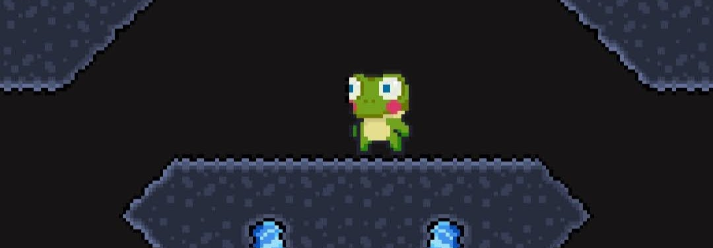
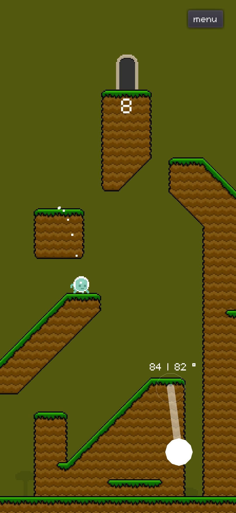
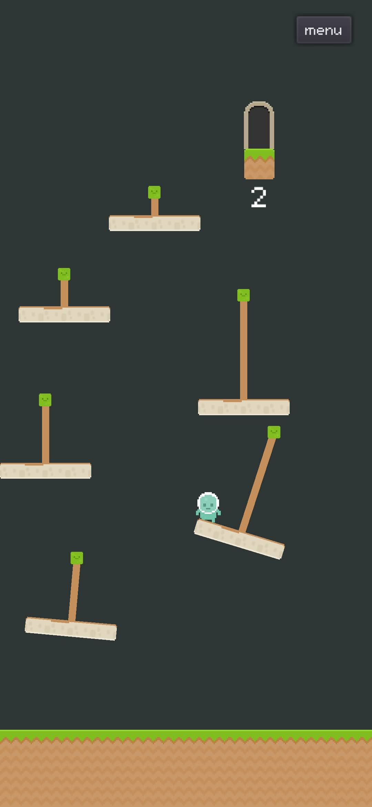
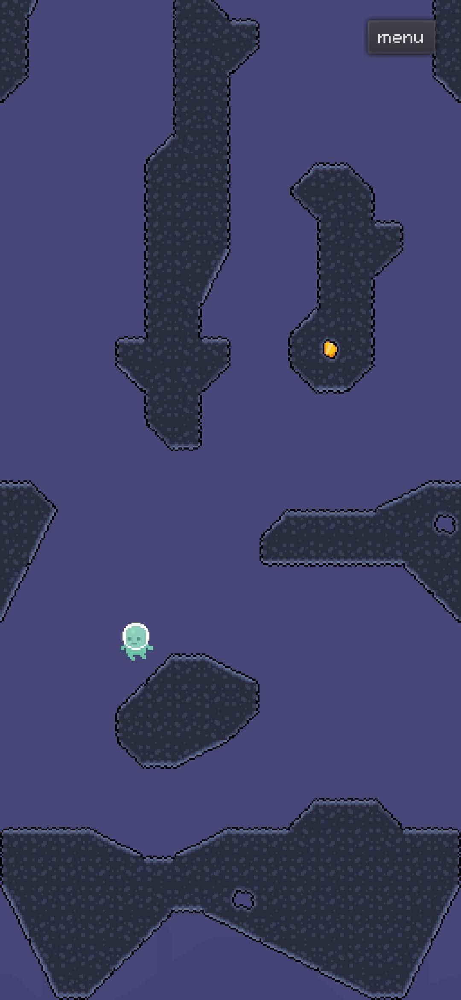

# the jump story

## фичи
* Вертикальный платформер с механикой рогатки
* Одни уровни - пазлы, другие - веселье с физикой
* Разные поверхности и кнопки с разными свойствами
## история
* История главного героя - через реплики NPC и таблички
* Один из npc "сопровождает" героя несколько уровней
* Уровни: от глубокой шахты до небесного дворца
## вовлечение и монетизация
* Счёт за уровень - количество прыжков
* За идеальное прохождение открываются шляпы и корона
* Чекпоинт на уровне за просмотр рекламы
* Покупка игры отключает рекламу и дает все шляпы

---

## скриншоты прототипа

---
## видео
<iframe width="100%" height="320" src="https://www.youtube.com/embed/ABrYhyOUzlE" title="YouTube video player" frameborder="0" allow="accelerometer; autoplay; clipboard-write; encrypted-media; gyroscope; picture-in-picture" allowfullscreen></iframe>
